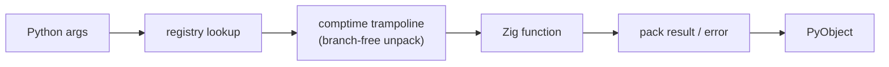

<p align="center">
  
</p>

<h1 align="center">Nano-FFI</h1>

<p align="center">
  <a href="https://github.com/fcarvajalbrown/Nano-FII/actions/workflows/ci.yml"></a>
  <a href="https://pypi.org/project/nano-ffi/"></a>
  <a href="https://pypi.org/project/nano-ffi/"></a>
  
  
  
</p>

<p align="center"><em>Near-zero-overhead Python-to-Zig FFI. Type-safe call wrappers generated at <code>comptime</code> — no runtime type inspection, no branches in the hot path.</em></p>

---

**Nano-FFI** lets Python call [Zig](https://ziglang.org) functions at close to native speed. Where `ctypes` and `cffi` inspect argument types on every call, Nano-FFI uses Zig's `comptime` engine to generate a type-safe trampoline for each function at compile time. A scalar call costs about **90 ns** — roughly **3.5–4× less overhead than `ctypes`** — with support for strings, bytes, zero-copy buffers, multi-value returns, and Zig-error-to-Python-exception mapping.

> **Zig performance. Python brain. Comptime safety.**

## Why Nano-FFI?

| | Nano-FFI | `ctypes` | `cffi` | PyO3 / Cython |
|---|---|---|---|---|
| Scalar call overhead | **~90 ns** | ~333 ns* | runtime-inspected | compile-time typed |
| Type check location | **compile time** | every call | every call | compile time |
| Native language | Zig | any C ABI | any C ABI | Rust / C |
| Build step required | pre-built wheels | none | C compiler | Rust / C toolchain |
| Zero-copy buffers | yes | manual | manual | yes |
| Zig errors → Python exceptions | yes | no | no | n/a |

<sub>*Nano-FFI and `ctypes` figures are measured by [this repo's benchmark](#benchmarks) on one machine; treat them as relative, not absolute.</sub>

If you write your native code in **Zig** and want the thinnest, fastest possible call path into it from Python, Nano-FFI is built for exactly that: the per-function trampoline is generated at `comptime`, so the hot path has no runtime type inspection and no branches to resolve.

## Contents

- [Why Nano-FFI?](#why-nano-ffi)
- [Install](#install)
- [Quickstart](#quickstart)
- [Supported types](#supported-types)
- [How it works](#how-it-works)
- [Benchmarks](#benchmarks)
- [Build from source](#build-from-source)
- [Architecture](#architecture)
- [Roadmap](#roadmap) · [API reference](docs/API.md)
- [License](#license)

## Install

From PyPI (pre-built wheels, no Zig required):

```bash
pip install nano-ffi
```

Or [build from source](#build-from-source) for the latest.

## Quickstart

```python
import nano_ffi

# Scalars
nano_ffi.call("add", 3, 4)          # 7
nano_ffi.call("mul", 2.5, 4.0)      # 10.0

# Strings (UTF-8 preserved)
nano_ffi.call("strlen", "hello")    # 5
nano_ffi.call("echo", "Ñuñoa")      # "Ñuñoa"

# Multiple return values -> tuple
q, r = nano_ffi.call("divmod", 17, 5)   # (3, 2)

# Zero-copy: Zig writes straight into a Python buffer
buf = bytearray(4)
nano_ffi.call("fill", buf, 7)       # buf -> bytearray(b'\x07\x07\x07\x07')

# Zig errors become Python exceptions
try:
    nano_ffi.call("div", 10, 0)
except RuntimeError as e:
    print(e)                        # "DivisionByZero"

# The module is self-describing
nano_ffi.list_functions()           # ['add', 'mul', 'echo', ...]
nano_ffi.signature("add")           # {'args': [('a','i64'),('b','i64')], 'ret': 'i64'}
```

## Supported types

| Name | Zig type | Python type | Notes |
|---|---|---|---|
| `i64` `i32` | `i64` `i32` | `int` | range-checked narrowing |
| `u64` `u32` `u8` | `u64` `u32` `u8` | `int` | unsigned; out-of-range -> `ValueError` |
| `f64` `f32` | `f64` `f32` | `float` | |
| `bool` | `bool` | `bool` | |
| `str` | `[]const u8` | `str` | borrowed UTF-8 in, copied out |
| `bytes` | `[]const u8` | `bytes` | borrowed in, copied out |
| `buffer` | `[]u8` | writable buffer | **zero-copy**, in-place (argument only) |

Up to 8 arguments and 8 return values per call. Full reference: [`docs/API.md`](docs/API.md).

## How it works

`makeTrampoline` runs at compile time. It unpacks each argument with a `comptime` `inline for` over the signature, so the compiler emits explicit typed assignments — not a runtime loop with per-element type tests. The dispatch path Python calls into has no branch left to resolve.



Only `python_ext.zig` touches `<Python.h>`; everything else is pure Zig over C-ABI-compatible types, so the core is unit-tested with no interpreter in the loop.

## Benchmarks

Median per-call overhead, `ReleaseFast`, 100k iterations (CPython 3.14, Windows x64):

| Call kind | Overhead |
|---|---|
| scalar (`add` i64) | ~94 ns |
| float (`mul` f64) | ~105 ns |
| string (`strlen`) | ~91 ns |
| multi-return (`divmod`) | ~124 ns |
| zero-copy buffer (`fill`) | ~125 ns |
| **`ctypes` baseline** | **~333 ns** |

A scalar Nano-FFI call carries roughly **3.5–4× less overhead** than a minimal `ctypes` call. Reproduce with:

```bash
python benchmarks/benchmark.py
```

Numbers are machine-dependent; the harness is the source of truth.

## Build from source

Requires [Zig 0.15.2](https://ziglang.org/download/) and a CPython 3.10+ with development headers.

**Windows** (helper auto-detects your Python headers/libs):

```powershell
.\scripts\build_local.ps1
```

**Linux / macOS:**

```bash
zig build -Doptimize=ReleaseFast \
  -Dpython-include="$(python3 -c 'import sysconfig; print(sysconfig.get_path("include"))')"
cp zig-out/lib/nano_ffi.so nano_ffi.so
```

Run the tests:

```bash
zig build test            # pure-Zig unit tests
python tests/test_python.py   # end-to-end + benchmark
```

## Architecture

```
src/
├── root.zig            # entry point; exports PyInit_nano_ffi
├── comptime_bridge.zig # comptime trampoline generator (the core)
├── registry.zig        # name -> (FnPtr, Signature)
├── python_ext.zig      # the only file that imports <Python.h>
├── allocator.zig       # Python/Zig memory boundary
└── version.zig         # single source of the version string
```

**How the speed works:** `makeTrampoline` uses an `inline for` over the signature at compile time. The compiler sees explicit typed assignments, not a loop — no branches, no runtime type checks in the hot path.

## Registering your own Zig function

```zig
const bridge = @import("nano_ffi").bridge;

fn add(a: i64, b: i64) i64 { return a + b; }

const AddTrampoline = bridge.makeTrampoline(add, .{
    .args = &.{ .{ .name = "a", .typ = .i64 }, .{ .name = "b", .typ = .i64 } },
    .ret  = .i64,
});

// Register at init time:
try my_registry.register("add", AddTrampoline.asPtr(), AddTrampoline.sig);
```

## Roadmap

Nano-FFI is at **1.0** — the public API (`call`, `version`, `list_functions`, `signature`), the supported type names, and the exception mapping are frozen and follow [semantic versioning](https://semver.org). See [`ROADMAP.md`](ROADMAP.md) for how it got here and [`CHANGELOG.md`](CHANGELOG.md) for release notes.

## License

MIT — see [`LICENSE`](LICENSE). Built with [Zig](https://ziglang.org) and the [CPython C-API](https://docs.python.org/3/c-api/).
